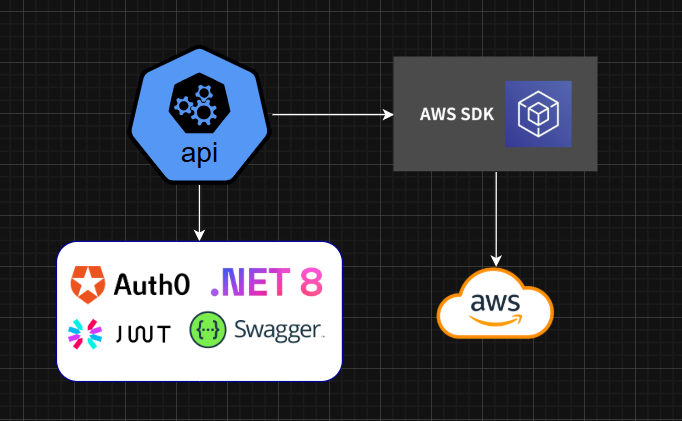

# Aws.Api
This is a .NET 8.0 API designed to interact with Amazon Web Services (AWS) resources, specifically EC2 and RDS. The API follows a modular architecture, separating services to ensure scalability, maintainability, and ease of future expansions.
<br>
Currently, the API retrieves information about EC2 instances and is in the process of expanding to include other resources such as RDS databases. To fetch data from AWS, you need to have the AWS CLI installed and configured on your machine, as it stores the credentials required for authentication.

### Api diagram:


### Structure
└─ .gitignore <br>
└─ ./Configurations <br>
└─ ./Contracts <br>
└─ ./Controllers <br>
└─ ./Mappers <br>
└─ ./Services <br>

└─ Dockerfile <br>
└─ README.md <br>

### Authorization with Auth0: to validate the authorization, you must set the environment variables in the appsettings files.
#### Currently the controller has the decoration: [Authorize(AuthenticationSchemes = "Auth0")]
```
"Auth0": {
    "Authority": "replace",
    "Audience": "replace"
}
```

### Dotnet build and run

```
dotner run
```

## Docker Build
### Until 7-12-2025 Docker has no vulnerabilities.
```
docker build -f Dockerfile -t aws-api .
```
```
docker run -d -p 7001:80 -e "ASPNETCORE_ENVIRONMENT=Development" --name aws-api aws-api
```
